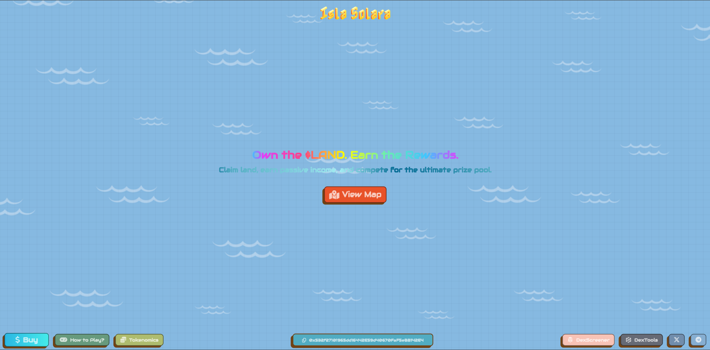
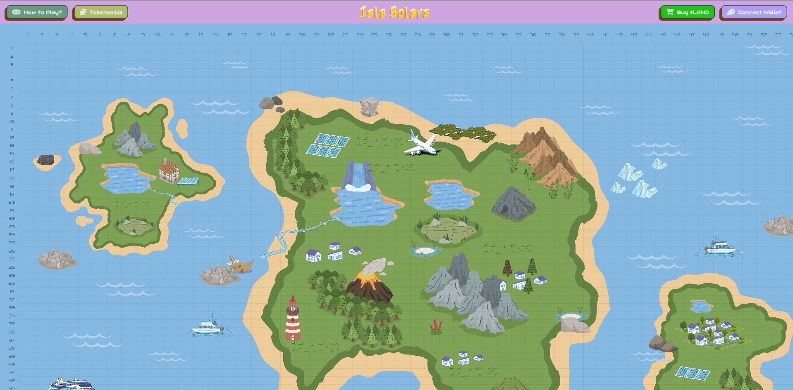
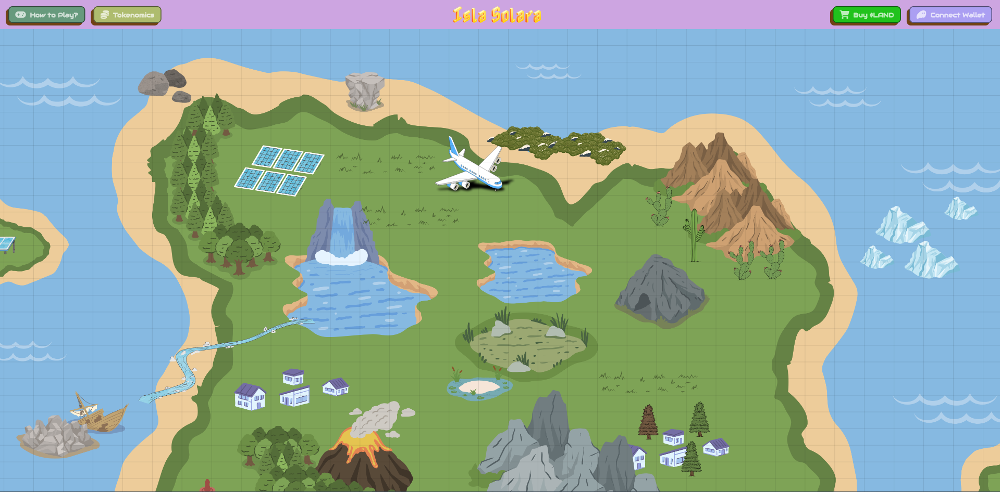
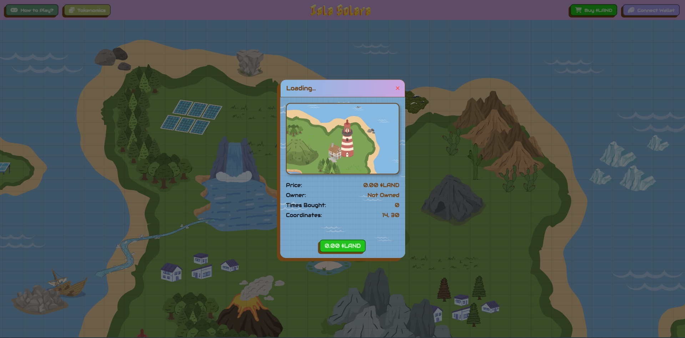

# Taxhavistan (Isla Solara)

Isla Solara is a Flutter web/mobile app. This repository contains the Flutter source code and assets to run the experience locally and deploy to the web.

## Features

- Responsive UI for mobile and desktop
- Map-based screen and interactive dialogs
- Asset pipeline configured for Flutter web

## Getting Started

Prerequisites:

- Flutter SDK installed and set up
- Dart SDK (bundled with Flutter)

Install dependencies:

```bash
flutter pub get
```

Run in debug mode:

```bash
flutter run -d chrome
```

Build for the web:

```bash
flutter build web --release
```

## Screenshots

Below are in-app screenshots located in the `screenshots/` directory.

<p align="center">
  
  
  
  <br/>
  
  
  
  
</p>

## Project Structure

- `lib/` — Dart source code
- `assets/` — images and fonts bundled with the app
- `web/` — web-specific static files (icons, index.html, manifest)
- `screenshots/` — app screenshots for documentation

## License

This project is provided as-is. Add your preferred license if needed.
